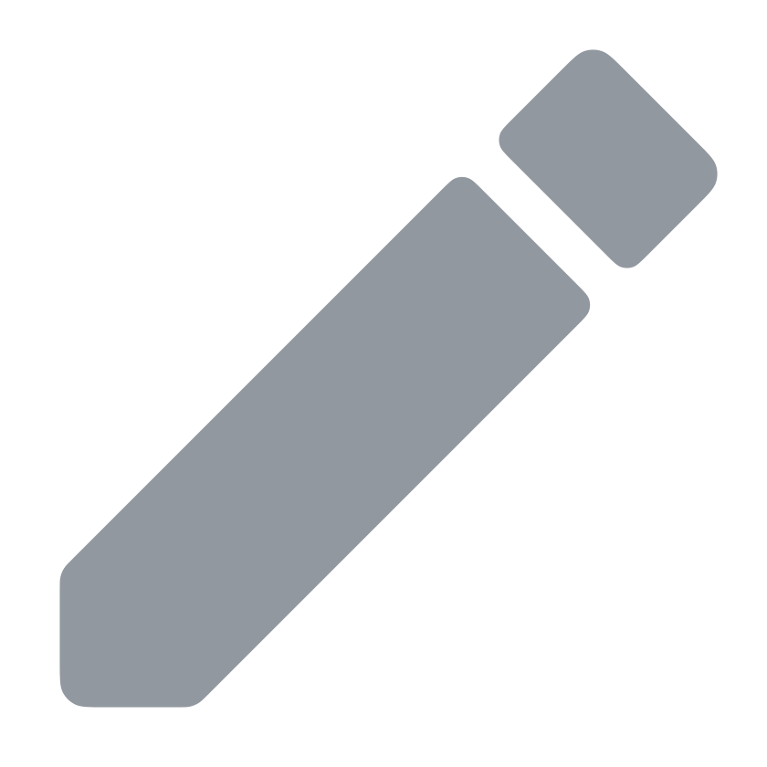

<p align="center">
  <h1 align="center">Koseka Website</h1>
  <p align="center">
    Contributions, corrections, and requests can be made through GitHub.
  </p>
  <p align="center">Thank you for your interest in the project, enjoy your reading! 🚀</p>
</p>

<div align="center">
  <a href="https://phased-versioning.koseka.net"></a>
  <a href="LICENSE"></a>
  <br>
  <a href="https://github.com/koseka/koseka-website/releases"></a>
  <a href="https://github.com/koseka/koseka-website"></a>
  <a href="https://github.com/koseka/koseka-website/commits/dev"></a>
  <a href="https://github.com/koseka/koseka-website/milestones"></a>
  <a href="https://github.com/koseka/koseka-website/stargazers"></a>
</div>

---

The source of [koseka.net](https://koseka.net), the website of **Koseka**. The client is a [Sycamore](https://sycamore.dev) web app compiled to WebAssembly and styled with [Tailwind CSS](https://tailwindcss.com), and the server is written in Rust as well. The site currently shows a teaser page: we are cooking.

<h2>&nbsp;&nbsp;Branches</h2>

| Branch | Description                                                 |
| :----- | :---------------------------------------------------------- |
| `dev`  | The development branch; no version branch has been cut yet. |

**Note for Contributors:** Please submit all feature requests and standard bug fixes to the **`dev`** branch.

<h2>&nbsp;&nbsp;Running Locally</h2>

First, make sure you have [Rust](https://www.rust-lang.org/tools/install) (with the `wasm32-unknown-unknown` target), the [Trunk](https://trunkrs.dev) WASM bundler, and [node.js](https://nodejs.org) with npm installed on your machine:

```sh
rustup target add wasm32-unknown-unknown                    # Adds the WASM compilation target.
cargo install trunk                                         # Installs the Trunk WASM bundler.
```

Then, clone the repository, install the development dependencies, and serve the client:

```sh
git clone https://github.com/koseka/koseka-website.git      # Clones the repository.
cd koseka-website                                           # Moves into the project directory.
npm install                                                 # Installs the development dependencies.
cd client && trunk serve                                    # Builds and serves the client on http://localhost:8080.
```

<h2>&nbsp;&nbsp;Structure</h2>

The `client/` directory contains the Sycamore web app, and the `server/` directory contains the Rust server that hosts the built site. The `assets/` directory is the raw asset library; the curated assets that actually ship with the site live in `client/assets/`.

<h2>&nbsp;&nbsp;Security</h2>

Vulnerabilities and sensitive information should not be reported via public GitHub issues. Please refer to the [Security Policy](SECURITY.md) for details on supported versions and instructions on how to responsibly disclose security concerns.

<h2>&nbsp;&nbsp;Contributing</h2>

This project is open to contributions and suggestions, and any help or feedback is highly appreciated. There is no code of conduct, but please be respectful and considerate when engaging with the community.

This project uses [Phased Versioning](https://phased-versioning.koseka.net), which defines the versioning, branching, and release rules, and commit messages follow the [Conventional Commits](https://www.conventionalcommits.org/en/v1.0.0/) specification. So, make sure to read both first before contributing to the project in any way. Additionally, please refer to the [Contribution Guide](CONTRIBUTING.md) for setup instructions and guidance on how to contribute the project.

Unless you explicitly state otherwise, any contribution intentionally submitted for inclusion in this project by you, shall be licensed as below, without any additional terms or conditions.

<h2>&nbsp;&nbsp;License</h2>

Copyright 2026 Amon Rayfa.

This project is licensed under the [Apache License (Version 2.0)](LICENSE).
